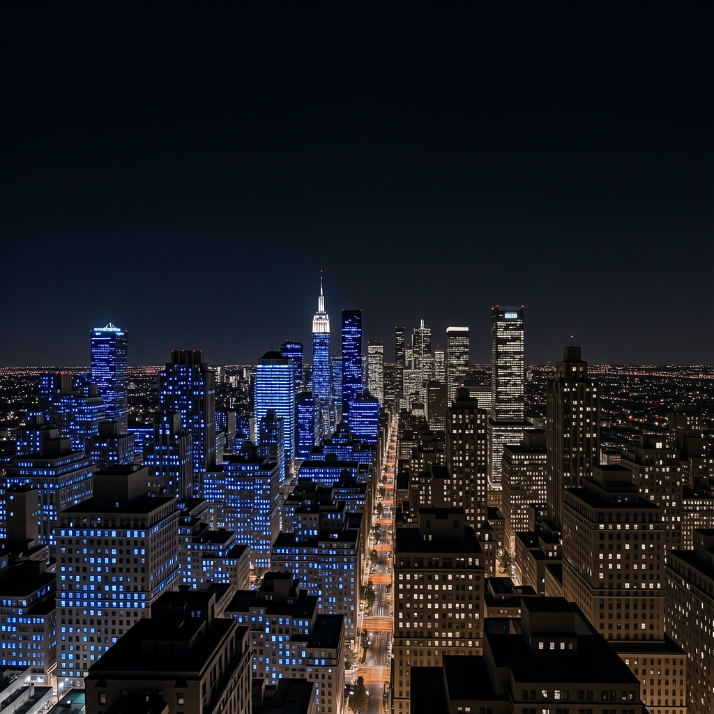

# LanPaint-Diffusers

Training-free diffusion inpainting and outpainting with [LanPaint](https://github.com/scraed/LanPaint), built on [Hugging Face Diffusers](https://github.com/huggingface/diffusers).

## Features

- **Diffusers-native**: Uses the `diffusers` library only. No ComfyUI or other graph-based UI dependency.
- **Multi-model**: One CLI and one pipeline API for all supported backends. Currently supported:
  - **Flux2 Klein** (`flux-klein`)
  - **Z-Image Turbo** (`z-image`)
  - **Stable Diffusion 3** (`sd3`)
- **Extensible**: More LanPaint-supported models will be added over time; new backends are integrated via the adapter registry.

---

## Usage

### Installation

- Python 3.10+ (3.12 tested), NVIDIA GPU and CUDA-compatible PyTorch recommended.
- **LanPaint** and **diffusers** are installed from GitHub (see `requirements.txt`); 

```bash
cd LanPaint-diffusers   # or your clone path
python -m venv .venv
source .venv/bin/activate   # Windows: .venv\Scripts\activate
pip install --upgrade pip
pip install -r requirements.txt
```

If you need a different PyTorch/CUDA build, install PyTorch first, then:

```bash
pip install -r requirements.txt --no-deps
```

Verify:

```bash
python -c "import torch, diffusers, LanPaint; print(torch.__version__, diffusers.__version__)"
python run_lanpaint.py --list-models
```

### Commands

**List registered models**

```bash
python run_lanpaint.py --list-models
```

**Inpaint** (image + mask)

```bash
python run_lanpaint.py --model z-image \
  --prompt "Change the shirt color to blue" \
  --image path/to/image.png \
  --mask path/to/mask.png
```

**Outpaint** (padding spec: `l`eft, `r`ight, `t`op, `b`ottom + pixels)

```bash
python run_lanpaint.py --model z-image \
  --prompt "Extend the scene naturally" \
  --image path/to/image.png \
  --outpaint-pad l200r200t200b200
```

- `--outpaint-pad` and `--mask` are mutually exclusive.
- Do not pass `--height` / `--width` when using `--outpaint-pad`.

**Useful options**

- `--guidance-scale`, `--num-steps`, `--seed`
- `--output <path>`: output image path
- `--model-id <hf-or-local-path>`: override checkpoint
- `--save-preprocess-dir <dir>`: save preprocess/debug images (canvas, mask, pre-blend decoded image)
- `--local-files-only`: skip Hub download

See `run_lanpaint.sh` for more example commands (Flux Klein, SD3, Z-Image inpaint/outpaint).

---

## Results Showcase

Below are visual examples for `flux-klein` and `z-image`. 

### Flux2 Klein (Example 24)

| Original | Masked | Diffusers Version | ComfyUI Version |
|:--------:|:------:|:-----------------:|:---------------:|
|  |  |  |  |

### Z-Image Turbo (Example 21)

| Original | Masked | Diffusers Version | ComfyUI Version |
|:--------:|:------:|:-----------------:|:---------------:|
|  |  |  |  |

---

## Library Structure

```
LanPaint-diffusers/
├── README.md
├── requirements.txt
├── run_lanpaint.py      # Unified CLI
├── run_lanpaint.sh      # Example commands
└── lanpaint_pipeline/
    ├── __init__.py
    ├── model_adapter.py   # Abstract adapter interface
    ├── pipeline.py        # LanPaintInpaintPipeline (orchestrator)
    ├── registry.py        # Model registry (flux-klein, sd3, z-image)
    ├── utils.py           # Blend, time helpers, image loading
    └── adapters/
        ├── __init__.py
        ├── flux_klein.py  # Flux2KleinAdapter
        ├── sd3.py         # SD3Adapter
        └── z_image.py     # ZImageAdapter
```

- **LanPaintInpaintPipeline** (`pipeline.py`): model-agnostic flow (preprocess → encode → LanPaint Langevin + scheduler loop → decode → blend).
- **ModelAdapter** (`model_adapter.py`): abstract interface (encode_prompt, encode_and_prepare, mask_to_latent_space, prepare_timesteps, predict_x0, decode_latents). Each backend implements one adapter in `adapters/`.
- **Registry** (`registry.py`): maps model keys to pipeline class, adapter class, and default config; adding a model is done by registering one entry.

---

## Citation

If you use this repository or LanPaint in your work, please cite:

```bibtex
@article{
zheng2025lanpaint,
title={LanPaint: Training-Free Diffusion Inpainting with Asymptotically Exact and Fast Conditional Sampling},
author={Candi Zheng and Yuan Lan and Yang Wang},
journal={Transactions on Machine Learning Research},
issn={2835-8856},
year={2025},
url={https://openreview.net/forum?id=JPC8JyOUSW},
note={}
}
```
